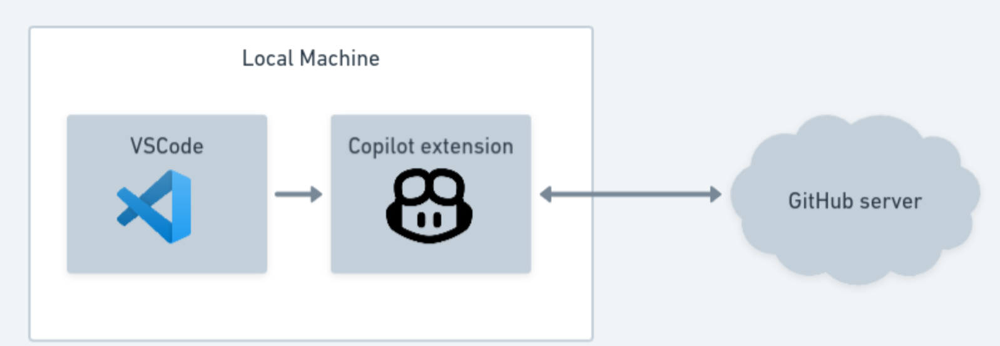

# PrivateGitHubCopilot

This project allows you to host your own GitHubCopilot-like model locally while using the official GitHubCopilot VSCode extension.

This is done using a single script: `githubcopilot_to_ooba_middleware.py`, which acts as a middleware between the official GitHub copilot VSCode extension and the oobabooga backend for compatibility. (I know that this might not be optimal, but this is a minimal hack that's easy to run)


Credit: I learned about the traffic redirecting from the Fauxpilot project [here](https://github.com/fauxpilot/fauxpilot/blob/main/documentation/client.md#copilot-plugin).


We use the oobabooga/text-generation-webui openai extension as a backend, since it supports almost all open source LLMs and is the defacto.


## 😁 Benefits of self-hosting

1. **Privacy**: This is the main benefit, especially for enterprise. No code is sent to the cloud when self-hosting, everything runs on your machine(s).
    

2. **Works without internet**
3. **Free**: No need to pay for your monthly subscription


## 😞 Limitations

1. GitHub copilot looks at multiple files for context. The current hack only looks at the current file
2. Open source models might not have suggestions as good as copilot, but still as good *most* of the time
3. GitHub copilot gives 10 suggestions, while this hack gives only 1 suggestion per completion
4. There's a bug where the first space in autocompletion is skipped, this is due to the oobabooga backend, not the model


## Installation:

1. Download and install the **oobabooga** backend: (I recommend using the [One-click installers](https://github.com/oobabooga/text-generation-webui#installation))
2. Open the `CMD_FLAGS.txt` and paste the following:
    ```sh
    --load-in-8bit --api --extensions openai api --model Deci_DeciCoder-1b --auto-launch
    ```
3. Run the **oobabooga** server: click on `start_windows.bat` (or whatever your OS)
4. install the [official GitHub copilot extension](https://marketplace.visualstudio.com/items?itemName=GitHub.copilot)
5. **Download a model**

    open the oobabooga UI, go to the **models** tab and download a code completion model. I'm using: `Deci/DeciCoder-1b`, paste that name, then click download, then click load once complete
    


<details>
<summary>Optional testing</summary>

A. (optional) Test the backend using `curl`:
    ```sh
    curl -X 'POST'   'http://localhost:5001/v1/engines/codegen/completions'   -H 'accept: application/json'   -H 'Content-Type: application/json'   -d '{"prompt":"def hello_w","suffix":"","max_tokens":500,"temperature":0.4,"top_p":1,"n":1,"stop":["\ndef ","\nclass ","\nif ","\n\n#"],"logprobs":2,"stream":true}'
    ```

B. (optional) Test that the model is working by going to the "chat" tab and clicking "generate".
    

</details>

6. Go to VSCode and modify the settings and add the following:

    ```json
    "github.copilot.advanced": {
        "debug.overrideEngine": "codegen",
        "debug.testOverrideProxyUrl": "http://localhost:8000", // address:port of middleware
        "debug.overrideProxyUrl": "http://localhost:8000",
    },
    ```

7. Run the proxy:

    ```sh
    pip install httpx fastapi uvicorn
    python githubcopilot_to_ooba_middleware.py --port 8000
    ```

<details>
<summary>(Optional): testing the middleware</summary>

    ```sh
    curl -X 'POST'   'http://localhost:8000/v1/engines/codegen/completions'   -H 'accept: application/json'   -H 'Content-Type: application/json'   -d '{"prompt":"def hello_w","suffix":"","max_tokens":500,"temperature":0.4,"top_p":1,"n":2,"stop":["\ndef ","\nclass ","\nif ","\n\n#"],"logprobs":2,"stream":true}'
    ```

    expected output

    ```sh
    data: {"id": "conv-1692741316942825472", "object": "text_completion.chunk", "created": 1692741316, "model": "Deci_DeciCoder-1b", "choices": [{"index": 0, "finish_reason": "stop", "text": "", "logprobs": {"top_logprobs": [{"<|endoftext|>": -0.4215908944606781, "<fim_middle>": -1.2965909242630005, "\n": -3.0741329193115234}]}}], "usage": {"prompt_tokens": 4, "completion_tokens": 13, "total_tokens": 17}}

    data: [DONE]
    ```

</details>

8. HAPPY CODING!

    To test that the copilot extension is working, either type some code and hope for a completion
    or use the command pallet (`Ctrl+Shift+P`) and search for `GitHub Copilot: Open Completions Panel`


<details>
  <summary>Advanced experimental hacks</summary>

The tokenizers used by Copilot are not the same, so you can overwrite them. However, I'm not sure how useful this actually is as I don't notice any change in performance

```sh
COPILOTPATH=$HOME/.vscode/extensions/github.copilot-1.105.353
MODELPATH=$HOME/Projects/oobabooga_linux/text-generation-webui/models/Deci_DeciCoder-1b

mv $COPILOTPATH/dist/resources $COPILOTPATH/dist/resources.backup
mkdir -p $COPILOTPATH/dist/resources/cushman001
mkdir -p $COPILOTPATH/dist/resources/cushman002

cp $MODELPATH/tokenizer.json $COPILOTPATH/dist/resources/cushman001/tokenizer_cushman001.json
cp $MODELPATH/merges.txt     $COPILOTPATH/dist/resources/cushman001/vocab_cushman001.bpe

cp $MODELPATH/tokenizer.json $COPILOTPATH/dist/resources/cushman002/tokenizer_cushman002.json
cp $MODELPATH/merges.txt     $COPILOTPATH/dist/resources/cushman002/vocab_cushman002.bpe

```

And to revert your changes, just uninstall and reinstall the extension.

OR:

```sh
rm -rf $COPILOTPATH/dist/resources
mv $COPILOTPATH/dist/resources.backup $COPILOTPATH/dist/resources
```

</details>

Here are some helpful open source projects I found while doing my research:
- https://github.com/fauxpilot/fauxpilot/tree/main
- https://github.com/Venthe/vscode-fauxpilot
